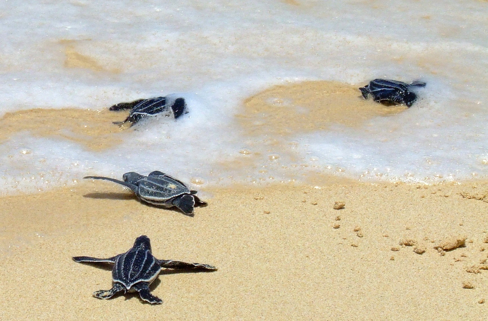
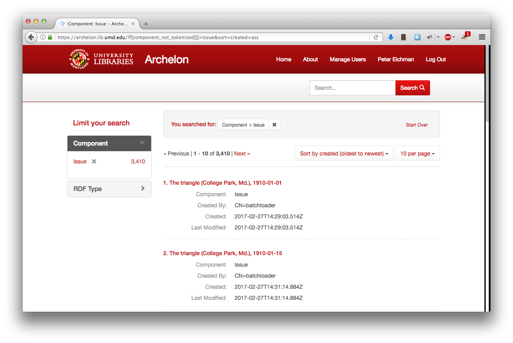

title: Introducing Archelon
author:
  name: Peter Eichman, Josh Westgard
  email: peichman@umd.edu, westgard@umd.edu
  url: https://github.com/umd-lib/archelon
theme: theme
output: index.html

--

# Introducing Archelon
## UMD Libraries Fedora 4 Administrative Tool

--

### Archelon 1.0 has Reached <del>the Ocean</del> Production!

  
<small class="photo-credit">U.S. Fish and Wildlife Service Southeast Region / <a href="http://creativecommons.org/licenses/by/2.0">CC-BY-2.0</a></small>

--

### Archelon?


<br/><small class="photo-credit">Dmitry Bogdanov / <a href="http://creativecommons.org/licenses/by/3.0">CC-BY-3.0</a></small>

--

### Archelon?

* Named for an ancient genus of giant sea turtles
* Name means “ruler turtle” in Greek.
* Lived ~80.5 million years ago in North America
* Largest ever recorded species of turtle by size
* Second largest by weight
* [More info on Wikipedia](https://en.wikipedia.org/wiki/Archelon)

--

### Screenshot: Home Page


--

### Screenshot: Search Results



--

### Screenshot: Details Page


--

### Screenshot: Details Page, Cont'd


--

### The Stack

* Fedora 4.7.0
* Solr 6
* Loris IIIF Image API Server
* PCDM Manifests IIIF Presentation API Server
* Mirador IIIF Viewer

--

### Solr 6: Subqueries

* Index the `pcdm:hasMember` field:

  ```
pcdm_member = pcdm:hasMember :: xsd:string
  ```
* Use subquery to get title at query time:

  ```xml
<str name="fl">*,pcdm_members_info:[subquery]</str>
<str name="pcdm_members_info.q">{!terms f=id v=$row.pcdm_members}</str>
<str name="pcdm_members_info.fl">id,title,component</str>
<str name="pcdm_members_info.rows">100</str>
  ```

--

### PCDM Manifests

* In-house developed Rails app
* (Partial) implementation of the IIIF Presentation API
* Converts RDF metadata modelled in PCDM to JSON format defined by the IIIF Presentation API
* Serves IIIF manifests for newspaper issues
* Redirects requests for pages to their corresponding issue
* <https://github.com/umd-lib/pcdm-manifests>

--

### Performance Challenges

* PCDM Manifests initially talked directly to Fedora 4
* Lots of requests
* Much...too...slow

--

### Solution

* Index all metadata needed to generate manifests in Solr
* Talk to Solr instead of Fedora 4 directly
* Single request returns all info needed
* Much faster!

--

### Loris Image Server

* Using version 2.1.0
* Contibuted code back to the Loris community
* Using the templated HTTP resolver
* Maps CURIE-style IIIF IDs:
  ```
  fcrepo:pcdm%2Fd3%2F05%2Fa8%2F4f%2Fd305a84f-6287-439c-b20d-b3d19e05aa44
  ```
* To Fedora 4 URIs:
  ```
  https://fcrepo.lib.umd.edu/fcrepo/rest/pcdm/d3/05/a8/4f/d305a84f-6287-439c-b20d-b3d19e05aa44
  ```

--

### Mirador IIIF Image Viewer

* Static wrapper around a build of Mirador
* Embeddable via `<iframe>`
* Some custom code contributed back to community
* Some changes are unique to UMD
* <https://github.com/umd-lib/mirador-static>
* <https://github.com/umd-lib/mirador>

--

### What’s Next?

  
<small class="photo-credit">U.S. Fish and Wildlife Service Southeast Region / <a href="http://creativecommons.org/licenses/by/2.0">CC-BY-2.0</a></small>

--

### Planned Features for 1.1

* OCR text search
* OCR hit highlighting
* Article segmentation

--

### Beyond 1.x: Writing to the Repo

* Complete management of digital objects
* Hydra-based
* Access control management
* Batch-loader integration

--

### GitHub

* <https://github.com/umd-lib/archelon>

--

### Image Links

* [Leatherback Sea Turtle Hatchlings](https://commons.wikimedia.org/wiki/File:Leatherbacks_crawling_to_the_sea.jpg)
* [Archelon Restoration](https://commons.wikimedia.org/wiki/File:Archelon1DB.jpg)

[CC-BY-2.0]: http://creativecommons.org/licenses/by/2.0
